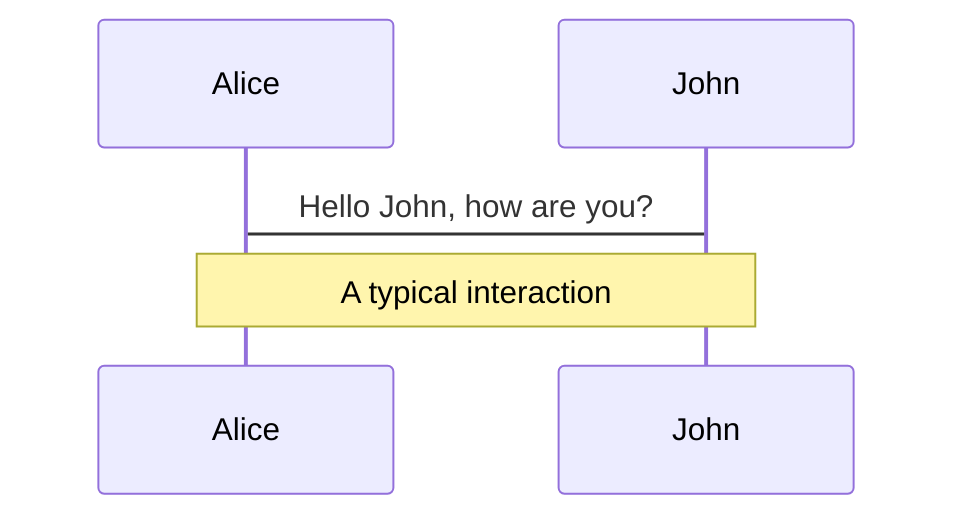
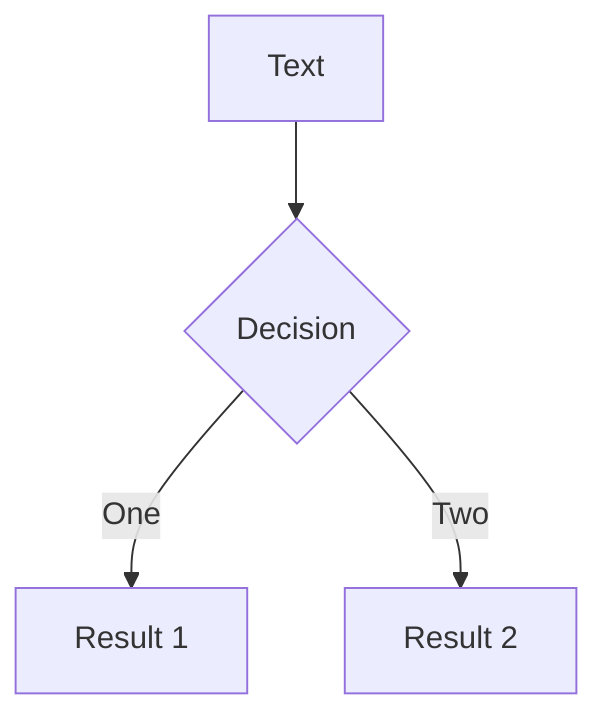
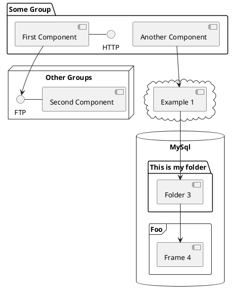

# Frontend News

---
transition: slide-left
---

# Loads of news!

But first, some data:

<div class="flex justify-between">
<div class="flex flex-col">
<ul>
<v-clicks>
MantTest Web
<li>
<div v-if="$slidev.nav.clicks >= 1" class="flex items-center gap-5">
  Start date: <RelativeDate :date="'Thu Feb 10 09:40:58 2022 +0100'" />   
</div>
</li>
<li>
<div v-if="$slidev.nav.clicks >= 2" class="flex items-center gap-5">
  Contributors: <AnimatedNumber :n="3" />
</div>
</li>
<li>
<div v-if="$slidev.nav.clicks >= 3" class="flex items-center gap-5">
  Number of commits: <AnimatedNumber :n="4333" />
</div>
</li>
<li>
<div v-if="$slidev.nav.clicks >= 4" class="flex items-center gap-5">
  Azure DevOps
</div>
</li>
<li>
<div v-if="$slidev.nav.clicks >= 5" class="items-center gap-5">
  Work Items closed:
  <ul>
    <li>
      New: <AnimatedNumber :n="96" />
    </li>
    <li>
      In Planning: <AnimatedNumber :n="9" />
    </li>
    <li>
      Planned: <AnimatedNumber :n="2" />
    </li>
    <li>
      In Progress: <AnimatedNumber :n="16" />
    </li>
    <li>
      To Publish: <AnimatedNumber :n="1" />
    </li>
    <li>
      To Validate: <AnimatedNumber :n="114" />
    </li>
    <li>
      Closed: <AnimatedNumber :n="164" />
    </li>
  </ul>
</div>
</li>
</v-clicks>
</ul>
</div>
<div class="text-center">

 4" src="/cfd_devops.png" style="height: 21rem" class="rounded-xl shadow" />
<div v-if="$slidev.nav.clicks >= 4" class="mt-4">
Transparency, Inspection and Adaptation
</div>
</div>

</div>

---
transition: slide-left
layout: image-right
image: /breaking-news.webp
---

# News

<div class="flex flex-col justify-around h-[80%]">

<v-clicks>

<h2> New QA <fluent-mdl2:test-auto-solid class="inline mx-2 my-auto" /> </h2>

<h2> New Team Member <carbon:user-follow class="inline mx-2 my-auto" /> </h2>

<h2> New Project <fluent-mdl2:new-team-project class="inline mx-2 my-auto" /> </h2>

</v-clicks>

</div>

---
transition: slide-left
---

<h1> New QA <fluent-mdl2:test-auto-solid class="inline mx-2 my-auto" /> </h1>


---
transition: slide-left
---

<h1> New Team Member <carbon:user-follow class="inline mx-2 my-auto" /> </h1>

---
transition: slide-left
---

<h1> New Project <fluent-mdl2:new-team-project class="inline mx-2 my-auto" /> </h1>

<div class="flex justify-around h-full">
<div class="flex flex-col">

<v-click>

### What?

</v-click>

<div class="flex items-center gap-4 mt-2 mb-8">


<fluent-mdl2:unknown-solid v-click="14" style="height: 5rem; width: 5rem;" />
</div>

<v-click>

### How?

</v-click>

<v-clicks>

* Monorepo setup
* NX
* Azure DevOps Teams

</v-clicks>


</div>

<div class="flex flex-col">
<v-click>

### Why?

</v-click>

<v-clicks>

* Code reuse
* Fast development
* Common practices
* Avoid context switching
* Design System?

</v-clicks>

</div>

</div>

---
transition: slide-left
---

<div class="absolute top-0 right-0 bot-0 w-full h-full">
<iframe src="/graph.html" class="h-full w-full" frameborder="0"></iframe>
</div>

---
transition: slide-up
---

<h1> New Project <fluent-mdl2:new-team-project class="inline mx-2 my-auto" /> </h1>

<div v-click-hide v-if="$slidev.nav.clicks < 1" class="flex h-[80%] w-full justify-around items-center">
<Tweet id="7269997868" />
</div>

<div class="flex h-[80%] w-full justify-around items-center">


</div>


---
transition: fade-in
layout: fact
---

# Tatu

---
transition: fade-out
layout: iframe-right
url: https://sketchfab.com/models/ee81451e0a814207be57e522effd70fd/embed?autospin=1&autostart=1&ui_hint=0&ui_theme=dark&dnt=1
preload: true
---

<h1> Project Tatu <game-icons:armadillo class="inline mx-2 my-auto text-orange-400 animate-flash" /> </h1>

<ul class="gap-5 flex flex-col">

<v-clicks>
<li>
Robust
</li>
<li>
Bugs for breakfast <fluent-mdl2:bug class="text-red" />
</li>
<li>
Habitat Engineer
</li>

</v-clicks>

</ul>

---
layout: center
class: text-center
---

## Thanks 🎉

---
transition: fade-out
---

# What is Slidev?

Slidev is a slides maker and presenter designed for developers, consist of the following features

- 📝 **Text-based** - focus on the content with Markdown, and then style them later
- 🎨 **Themable** - theme can be shared and used with npm packages
- 🧑‍💻 **Developer Friendly** - code highlighting, live coding with autocompletion
- 🤹 **Interactive** - embedding Vue components to enhance your expressions
- 🎥 **Recording** - built-in recording and camera view
- 📤 **Portable** - export into PDF, PNGs, or even a hostable SPA
- 🛠 **Hackable** - anything possible on a webpage

<br>
<br>

Read more about [Why Slidev?](https://sli.dev/guide/why)

<!--
You can have `style` tag in markdown to override the style for the current page.
Learn more: https://sli.dev/guide/syntax#embedded-styles
-->

<style>
h1 {
  background-color: #2B90B6;
  background-image: linear-gradient(45deg, #4EC5D4 10%, #146b8c 20%);
  background-size: 100%;
  -webkit-background-clip: text;
  -moz-background-clip: text;
  -webkit-text-fill-color: transparent;
  -moz-text-fill-color: transparent;
}
</style>

<!--
Here is another comment.
-->

---
transition: slide-up
---

# Navigation

Hover on the bottom-left corner to see the navigation's controls panel, [learn more](https://sli.dev/guide/navigation.html)

### Keyboard Shortcuts

|     |     |
| --- | --- |
| <kbd>right</kbd> / <kbd>space</kbd>| next animation or slide |
| <kbd>left</kbd>  / <kbd>shift</kbd><kbd>space</kbd> | previous animation or slide |
| <kbd>up</kbd> | previous slide |
| <kbd>down</kbd> | next slide |

<!-- https://sli.dev/guide/animations.html#click-animations -->

<p v-after class="absolute bottom-23 left-45 opacity-30 transform -rotate-10">Here!</p>

---
layout: image-right
image: https://source.unsplash.com/collection/94734566/1920x1080
---

# Code

Use code snippets and get the highlighting directly![^1]

```ts {all|2|1-6|9|all}
interface User {
  id: number
  firstName: string
  lastName: string
  role: string
}

function updateUser(id: number, update: User) {
  const user = getUser(id)
  const newUser = { ...user, ...update }
  saveUser(id, newUser)
}
```

<arrow v-click="3" x1="400" y1="420" x2="230" y2="330" color="#564" width="3" arrowSize="1" />

[^1]: [Learn More](https://sli.dev/guide/syntax.html#line-highlighting)

<style>
.footnotes-sep {
  @apply mt-20 opacity-10;
}
.footnotes {
  @apply text-sm opacity-75;
}
.footnote-backref {
  display: none;
}
</style>

---

# Components

<div grid="~ cols-2 gap-4">
<div>

You can use Vue components directly inside your slides.

We have provided a few built-in components like `<Tweet/>` and `<Youtube/>` that you can use directly. And adding your custom components is also super easy.

```html
<Counter :count="10" />
```

<!-- ./components/Counter.vue -->
<Counter :count="10" m="t-4" />

Check out [the guides](https://sli.dev/builtin/components.html) for more.

</div>
<div>

```html
<Tweet id="1390115482657726468" />
```

<Tweet id="1390115482657726468" scale="0.65" />

</div>
</div>

<!--
Presenter note with **bold**, *italic*, and ~~striked~~ text.

Also, HTML elements are valid:
<div class="flex w-full">
  <span style="flex-grow: 1;">Left content</span>
  <span>Right content</span>
</div>
-->


---
class: px-20
---

# Themes

Slidev comes with powerful theming support. Themes can provide styles, layouts, components, or even configurations for tools. Switching between themes by just **one edit** in your frontmatter:

<div grid="~ cols-2 gap-2" m="-t-2">

```yaml
---
theme: default
---
```

```yaml
---
theme: seriph
---
```


</div>

Read more about [How to use a theme](https://sli.dev/themes/use.html) and
check out the [Awesome Themes Gallery](https://sli.dev/themes/gallery.html).

---
preload: false
---

# Animations

Animations are powered by [@vueuse/motion](https://motion.vueuse.org/).

```html
<div
  v-motion
  :initial="{ x: -80 }"
  :enter="{ x: 0 }">
  Slidev
</div>
```

<div class="w-60 relative mt-6">
  <div class="relative w-40 h-40">
    
    
    
  </div>

  <div
    class="text-5xl absolute top-14 left-40 text-[#2B90B6] -z-1"
    v-motion
    :initial="{ x: -80, opacity: 0}"
    :enter="{ x: 0, opacity: 1, transition: { delay: 2000, duration: 1000 } }">
    Slidev
  </div>
</div>

<!-- vue script setup scripts can be directly used in markdown, and will only affects current page -->
<script setup lang="ts">
const final = {
  x: 0,
  y: 0,
  rotate: 0,
  scale: 1,
  transition: {
    type: 'spring',
    damping: 10,
    stiffness: 20,
    mass: 2
  }
}
</script>

<div
  v-motion
  :initial="{ x:35, y: 40, opacity: 0}"
  :enter="{ y: 0, opacity: 1, transition: { delay: 3500 } }">

[Learn More](https://sli.dev/guide/animations.html#motion)

</div>

---

# LaTeX

LaTeX is supported out-of-box powered by [KaTeX](https://katex.org/).

<br>

Inline $\sqrt{3x-1}+(1+x)^2$

Block
$$
\begin{array}{c}

\nabla \times \vec{\mathbf{B}} -\, \frac1c\, \frac{\partial\vec{\mathbf{E}}}{\partial t} &
= \frac{4\pi}{c}\vec{\mathbf{j}}    \nabla \cdot \vec{\mathbf{E}} & = 4 \pi \rho \\

\nabla \times \vec{\mathbf{E}}\, +\, \frac1c\, \frac{\partial\vec{\mathbf{B}}}{\partial t} & = \vec{\mathbf{0}} \\

\nabla \cdot \vec{\mathbf{B}} & = 0

\end{array}
$$

<br>

[Learn more](https://sli.dev/guide/syntax#latex)

---

# Diagrams

You can create diagrams / graphs from textual descriptions, directly in your Markdown.

<div class="grid grid-cols-3 gap-10 pt-4 -mb-6">







</div>

[Learn More](https://sli.dev/guide/syntax.html#diagrams)

---
src: ./pages/multiple-entries.md
hide: false
---

---
layout: center
class: text-center
---

# Learn More

[Documentations](https://sli.dev) · [GitHub](https://github.com/slidevjs/slidev) · [Showcases](https://sli.dev/showcases.html)
